## 1. Purpose

This document provides a **comprehensive guide to AWS services** for data engineers, covering everything from foundational concepts to production-ready architectures. Whether you're starting your AWS journey or looking to deepen your expertise, this guide will help you master the essential services for building scalable data pipelines.

**What you'll learn:**

* **Core AWS concepts** - Accounts, regions, IAM, networking
* **Compute services** - Lambda, EC2, ECS, EKS
* **Storage services** - S3, EBS, EFS
* **Data services** - Athena, Glue, Redshift, Kinesis
* **Messaging** - SQS, SNS, EventBridge
* **Networking** - VPC, subnets, security groups, NAT gateways
* **Architecture patterns** - Serverless data pipelines, event-driven architectures

---

## 2. Prerequisites

### 2.1 What You Need

* **AWS Account** - Free tier available for learning
* **Basic programming knowledge** - Python preferred
* **Understanding of data engineering concepts** - ETL, data pipelines, data lakes
* **Command line familiarity** - AWS CLI basics

### 2.2 AWS Free Tier

Many services offer free tier usage:

* **S3** - 5 GB storage, 20,000 GET requests
* **Lambda** - 1M free requests per month
* **Athena** - 10 GB data scanned per month
* **SQS** - 1M requests per month
* **SNS** - 1M publishes per month

---

## 3. AWS Fundamentals

### 3.1 AWS Account Structure

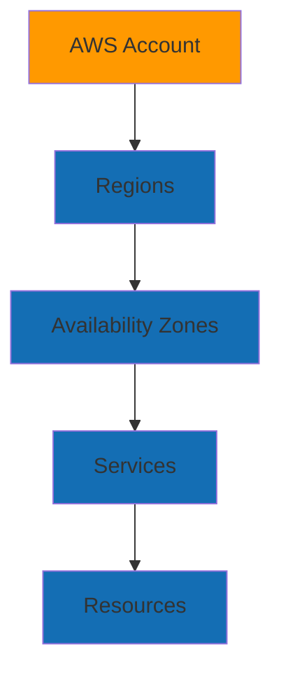

**Key Concepts:**

* **Account** - Your AWS account (root account + IAM users/roles)
* **Regions** - Geographic locations (us-east-1, eu-west-1, etc.)
* **Availability Zones (AZs)** - Isolated data centers within regions
* **Services** - AWS offerings (S3, Lambda, etc.)
* **Resources** - Instances of services (buckets, functions, tables)

### 3.2 Identity and Access Management (IAM)

**IAM Components:**

```yaml
Users: Individual accounts for people
Groups: Collections of users
Roles: Temporary credentials for services/resources
Policies: Permissions (JSON documents)
```

**Example Policy:**

```json
{
  "Version": "2012-10-17",
  "Statement": [
    {
      "Effect": "Allow",
      "Action": [
        "s3:GetObject",
        "s3:PutObject"
      ],
      "Resource": "arn:aws:s3:::data-lake-bucket/*"
    }
  ]
}
```

**Best Practices:**

* **Least privilege** - Grant minimum required permissions
* **Use roles** - Prefer roles over access keys
* **MFA** - Enable multi-factor authentication
* **Regular audits** - Review and remove unused permissions

---

## 4. Networking Fundamentals

### 4.1 Virtual Private Cloud (VPC)

**VPC Architecture:**

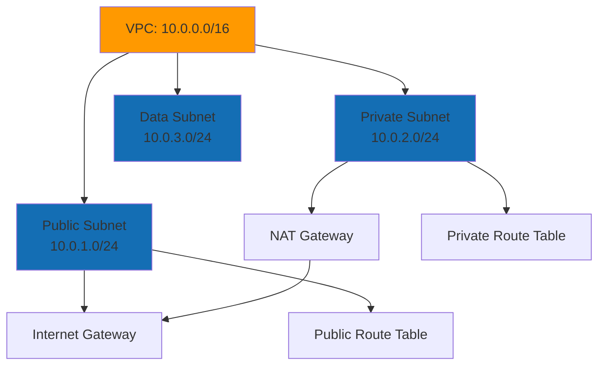

**VPC Components:**

* **CIDR Blocks** - IP address ranges (e.g., 10.0.0.0/16)
* **Subnets** - Network segments within VPC
* **Route Tables** - Define traffic routing
* **Internet Gateway** - Connect to internet
* **NAT Gateway** - Outbound internet for private subnets
* **Security Groups** - Firewall rules (stateful)
* **NACLs** - Network-level firewall (stateless)

### 4.2 Creating a VPC

**Via AWS Console:**

1. Navigate to **VPC Dashboard**
2. Click **Create VPC**
3. Configure:
   * **Name**: `data-engineering-vpc`
   * **IPv4 CIDR**: `10.0.0.0/16`
   * **Tenancy**: Default
4. Create subnets:
   * Public: `10.0.1.0/24` (us-east-1a)
   * Private: `10.0.2.0/24` (us-east-1b)
   * Data: `10.0.3.0/24` (us-east-1c)

**Via CLI:**

```bash
# Create VPC
aws ec2 create-vpc \
  --cidr-block 10.0.0.0/16 \
  --tag-specifications 'ResourceType=vpc,Tags=[{Key=Name,Value=data-engineering-vpc}]'

# Create public subnet
aws ec2 create-subnet \
  --vpc-id vpc-xxxxx \
  --cidr-block 10.0.1.0/24 \
  --availability-zone us-east-1a

# Create internet gateway
aws ec2 create-internet-gateway
aws ec2 attach-internet-gateway \
  --vpc-id vpc-xxxxx \
  --internet-gateway-id igw-xxxxx
```

### 4.3 Security Groups

**Example Security Group Rules:**

```yaml
Inbound Rules:
  - Type: SSH
    Port: 22
    Source: 0.0.0.0/0 (your IP only in production!)
  
  - Type: HTTPS
    Port: 443
    Source: 10.0.0.0/16 (VPC only)

Outbound Rules:
  - Type: All traffic
    Port: All
    Destination: 0.0.0.0/0
```

**Best Practices:**

* **Least privilege** - Only allow necessary ports
* **Specific sources** - Avoid 0.0.0.0/0 when possible
* **Separate groups** - Different groups for different tiers
* **Document rules** - Add descriptions to rules

---

## 5. Storage Services

### 5.1 Amazon S3 (Simple Storage Service)

**S3 Architecture:**

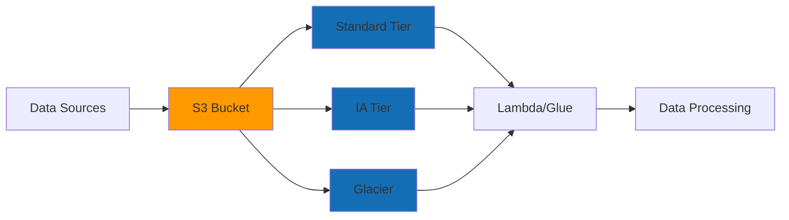

**S3 Storage Classes:**

* **Standard** - Frequently accessed data
* **Standard-IA** - Infrequently accessed (cheaper storage, retrieval cost)
* **Glacier** - Archive (very cheap, slow retrieval)
* **Intelligent-Tiering** - Automatically moves between tiers

**S3 Best Practices:**

```python
import boto3

s3 = boto3.client('s3')

# Upload file
s3.upload_file(
    'local-file.csv',
    'data-lake-bucket',
    'raw-data/2024/01/15/file.csv'
)

# List objects with prefix
response = s3.list_objects_v2(
    Bucket='data-lake-bucket',
    Prefix='raw-data/2024/01/'
)

# Download file
s3.download_file(
    'data-lake-bucket',
    'processed-data/file.csv',
    'local-file.csv'
)
```

**S3 Lifecycle Policies:**

```json
{
  "Rules": [
    {
      "Id": "Move to IA after 30 days",
      "Status": "Enabled",
      "Transitions": [
        {
          "Days": 30,
          "StorageClass": "STANDARD_IA"
        }
      ]
    },
    {
      "Id": "Archive to Glacier after 90 days",
      "Status": "Enabled",
      "Transitions": [
        {
          "Days": 90,
          "StorageClass": "GLACIER"
        }
      ]
    }
  ]
}
```

### 5.2 S3 Data Lake Patterns

**Partitioning Strategy:**

```
s3://data-lake-bucket/
├── raw/
│   ├── year=2024/
│   │   ├── month=01/
│   │   │   ├── day=15/
│   │   │   │   └── data.parquet
│   │   │   └── day=16/
│   │   └── month=02/
├── processed/
│   └── year=2024/month=01/
└── curated/
    └── year=2024/month=01/
```

**Benefits:**

* **Query performance** - Partition pruning in Athena/Spark
* **Cost optimization** - Scan only needed partitions
* **Organization** - Clear data structure

---

## 6. Compute Services

### 6.1 AWS Lambda

**Lambda Architecture:**

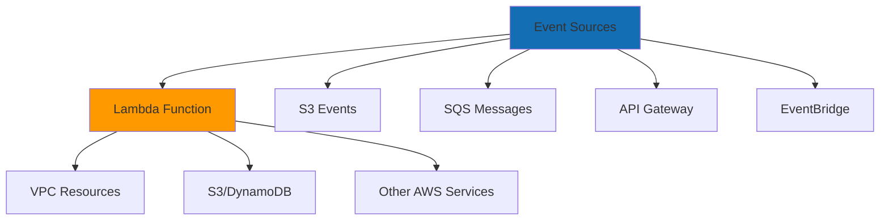

**Lambda Function Example:**

```python
import json
import boto3

s3 = boto3.client('s3')

def lambda_handler(event, context):
    """
    Process S3 object upload event
    """
    # Extract bucket and key from event
    for record in event['Records']:
        bucket = record['s3']['bucket']['name']
        key = record['s3']['object']['key']
        
        # Process the file
        response = s3.get_object(Bucket=bucket, Key=key)
        data = response['Body'].read()
        
        # Your processing logic here
        processed_data = process_data(data)
        
        # Write to destination
        s3.put_object(
            Bucket='processed-bucket',
            Key=f'processed/{key}',
            Body=processed_data
        )
    
    return {
        'statusCode': 200,
        'body': json.dumps('Processing complete')
    }

def process_data(data):
    # Your data transformation logic
    return data
```

**Lambda Configuration:**

```yaml
Runtime: Python 3.11
Memory: 512 MB (adjust based on workload)
Timeout: 5 minutes (max 15 minutes)
Environment Variables:
  - DATA_BUCKET: processed-data-bucket
  - LOG_LEVEL: INFO
VPC Configuration:
  - Subnets: Private subnets
  - Security Groups: Lambda SG
```

**Lambda Best Practices:**

* **Idempotency** - Functions should be safe to retry
* **Error handling** - Use Dead Letter Queues (DLQ)
* **Monitoring** - CloudWatch Logs and Metrics
* **Cold starts** - Use provisioned concurrency for critical paths
* **Layers** - Share code and dependencies

### 6.2 Lambda with VPC

**VPC Configuration:**

```python
import boto3
import os

# When Lambda is in VPC, use VPC endpoints or NAT Gateway
# for AWS service access

def lambda_handler(event, context):
    # Access RDS in private subnet
    rds_client = boto3.client('rds')
    
    # Access S3 via VPC endpoint (preferred)
    s3_client = boto3.client('s3',
        endpoint_url=os.environ.get('S3_VPC_ENDPOINT')
    )
    
    return {'statusCode': 200}
```

**Important Notes:**

* **Cold starts** - VPC Lambdas have longer cold starts (~10s)
* **VPC Endpoints** - Use for S3, DynamoDB to avoid NAT costs
* **Security Groups** - Lambda needs outbound rules for AWS APIs

---

## 7. Data Query Services

### 7.1 Amazon Athena

**Athena Architecture:**

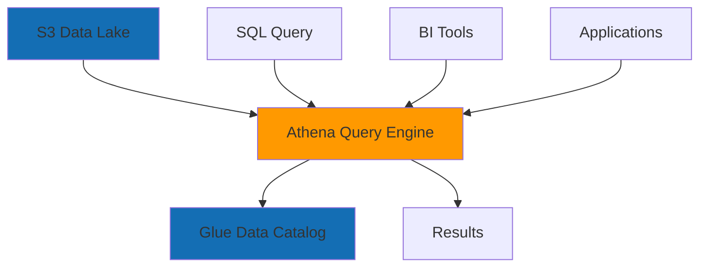

**Setting Up Athena:**

1. **Create S3 bucket** for query results
2. **Set up Glue Data Catalog** (or use Athena's built-in catalog)
3. **Create tables** from S3 data
4. **Query** using SQL

**Creating a Table:**

```sql
CREATE EXTERNAL TABLE raw_events (
    event_id string,
    user_id int,
    event_timestamp timestamp,
    event_type string,
    properties map<string,string>
)
PARTITIONED BY (
    year int,
    month int,
    day int
)
STORED AS PARQUET
LOCATION 's3://data-lake-bucket/raw-events/'
TBLPROPERTIES (
    'projection.enabled' = 'true',
    'projection.year.type' = 'integer',
    'projection.year.range' = '2020,2030',
    'projection.month.type' = 'integer',
    'projection.month.range' = '1,12',
    'projection.day.type' = 'integer',
    'projection.day.range' = '1,31',
    'storage.location.template' = 's3://data-lake-bucket/raw-events/year=${year}/month=${month}/day=${day}/'
);
```

**Querying Data:**

```sql
-- Simple query
SELECT 
    event_type,
    COUNT(*) as event_count
FROM raw_events
WHERE year = 2024
  AND month = 1
  AND day = 15
GROUP BY event_type;

-- Join with another table
SELECT 
    e.user_id,
    u.email,
    COUNT(*) as events
FROM raw_events e
JOIN users u ON e.user_id = u.user_id
WHERE e.year = 2024
GROUP BY e.user_id, u.email;
```

**Athena Best Practices:**

* **Partition data** - Reduces data scanned
* **Use columnar formats** - Parquet, ORC (much faster)
* **Compress data** - Snappy, Gzip
* **Use result caching** - For repeated queries
* **Limit columns** - SELECT only needed columns

### 7.2 Cost Optimization

**Athena Pricing:**

* **$5 per TB scanned** (first 10 TB free/month)
* **No charge** for failed queries
* **Results storage** - S3 charges apply

**Optimization Tips:**

```sql
-- BAD: Scans entire table
SELECT * FROM large_table;

-- GOOD: Use partitions
SELECT * FROM large_table
WHERE year = 2024 AND month = 1;

-- GOOD: Select specific columns
SELECT user_id, event_type
FROM large_table
WHERE year = 2024;

-- GOOD: Use LIMIT for exploration
SELECT * FROM large_table
LIMIT 100;
```

---

## 8. Messaging Services

### 8.1 Amazon SQS (Simple Queue Service)

**SQS Architecture:**

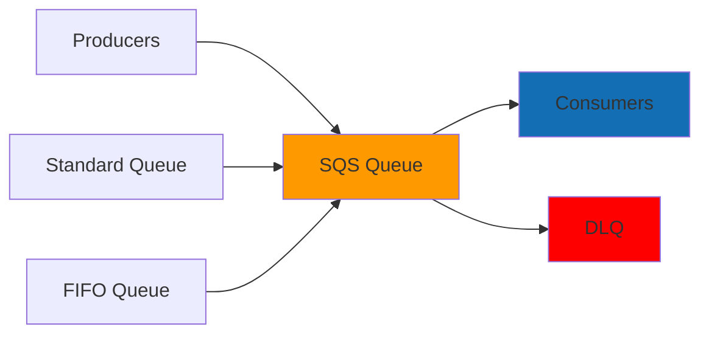

**Queue Types:**

* **Standard Queue** - At-least-once delivery, best effort ordering
* **FIFO Queue** - Exactly-once delivery, strict ordering

**SQS Producer:**

```python
import boto3
import json

sqs = boto3.client('sqs', region_name='us-east-1')

queue_url = 'https://sqs.us-east-1.amazonaws.com/ACCOUNT/data-processing-queue'

# Send message
response = sqs.send_message(
    QueueUrl=queue_url,
    MessageBody=json.dumps({
        'bucket': 'data-lake-bucket',
        'key': 'raw-data/file.csv',
        'timestamp': '2024-01-15T10:00:00Z'
    })
)

# Send batch (up to 10 messages)
messages = [
    {'Id': '1', 'MessageBody': json.dumps({'file': f'file_{i}.csv'})}
    for i in range(10)
]

sqs.send_message_batch(
    QueueUrl=queue_url,
    Entries=messages
)
```

**SQS Consumer (Lambda):**

```python
import json
import boto3

sqs = boto3.client('sqs')

def lambda_handler(event, context):
    for record in event['Records']:
        # Parse message
        message_body = json.loads(record['body'])
        
        # Process message
        process_file(message_body['bucket'], message_body['key'])
        
        # Delete message (Lambda does this automatically on success)
        # For manual processing:
        # sqs.delete_message(
        #     QueueUrl=queue_url,
        #     ReceiptHandle=record['receiptHandle']
        # )
    
    return {'statusCode': 200}

def process_file(bucket, key):
    # Your processing logic
    pass
```

**SQS Configuration:**

```yaml
Visibility Timeout: 30 seconds (how long message is hidden)
Message Retention: 14 days (max)
Dead Letter Queue: After 3 failed attempts
Long Polling: 20 seconds (reduces API calls)
```

**SQS Best Practices:**

* **Use long polling** - Reduces empty responses
* **Set appropriate visibility timeout** - Based on processing time
* **Use DLQ** - Handle failed messages
* **Batch operations** - Send/receive in batches
* **Monitor metrics** - ApproximateNumberOfMessages, etc.

### 8.2 Amazon SNS (Simple Notification Service)

**SNS Architecture:**

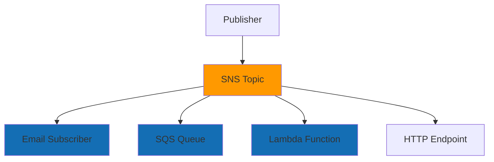

**SNS Publisher:**

```python
import boto3

sns = boto3.client('sns')

topic_arn = 'arn:aws:sns:us-east-1:ACCOUNT:data-processing-topic'

# Publish message
response = sns.publish(
    TopicArn=topic_arn,
    Message=json.dumps({
        'default': json.dumps({
            'event': 'data_processed',
            'bucket': 'processed-bucket',
            'key': 'results/data.csv'
        })
    }),
    MessageStructure='json',
    Subject='Data Processing Complete'
)
```

**SNS Subscriber (Lambda):**

```python
def lambda_handler(event, context):
    # SNS sends messages in Records array
    for record in event['Records']:
        sns_message = json.loads(record['Sns']['Message'])
        
        # Process notification
        handle_notification(sns_message)
    
    return {'statusCode': 200}
```

**SNS Use Cases:**

* **Event notifications** - Pipeline completion, errors
* **Fan-out pattern** - One event to multiple subscribers
* **Alerts** - CloudWatch alarms → SNS → Email/SMS
* **Decoupling** - Loose coupling between services

### 8.3 Event-Driven Architecture

**Complete Pattern:**

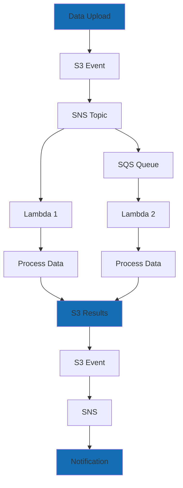

**Example: S3 → SNS → SQS → Lambda**

```python
# Lambda triggered by S3 event
def s3_handler(event, context):
    sns = boto3.client('sns')
    
    for record in event['Records']:
        bucket = record['s3']['bucket']['name']
        key = record['s3']['object']['key']
        
        # Publish to SNS
        sns.publish(
            TopicArn='arn:aws:sns:us-east-1:ACCOUNT:data-topic',
            Message=json.dumps({
                'bucket': bucket,
                'key': key,
                'event': 'object_created'
            })
        )
```

---

## 9. Data Processing Services

### 9.1 AWS Glue

**Glue Architecture:**

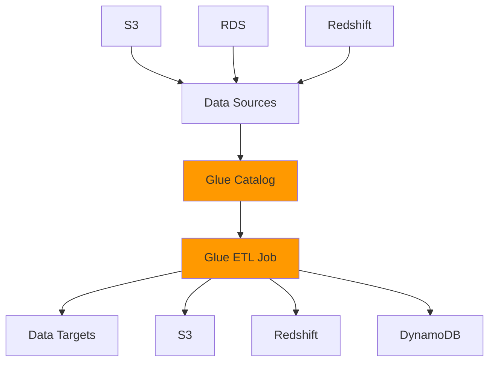

**Glue Components:**

* **Data Catalog** - Metadata store (tables, schemas)
* **ETL Jobs** - Spark-based data transformations
* **Crawlers** - Auto-discover schemas
* **Triggers** - Schedule or event-based execution

**Glue ETL Job:**

```python
import sys
from awsglue.transforms import *
from awsglue.utils import getResolvedOptions
from pyspark.context import SparkContext
from awsglue.context import GlueContext
from awsglue.job import Job

args = getResolvedOptions(sys.argv, ['JOB_NAME'])
sc = SparkContext()
glueContext = GlueContext(sc)
spark = glueContext.spark_session
job = Job(glueContext)
job.init(args['JOB_NAME'], args)

# Read from catalog
datasource = glueContext.create_dynamic_frame.from_catalog(
    database="raw_data",
    table_name="events"
)

# Transform
transformed = ApplyMapping.apply(
    frame=datasource,
    mappings=[
        ("event_id", "string", "event_id", "string"),
        ("user_id", "int", "user_id", "bigint"),
        ("timestamp", "timestamp", "event_timestamp", "timestamp")
    ]
)

# Write to S3
glueContext.write_dynamic_frame.from_options(
    frame=transformed,
    connection_type="s3",
    connection_options={
        "path": "s3://processed-bucket/events/"
    },
    format="parquet"
)

job.commit()
```

---

## 10. Advanced Patterns

### 10.1 Serverless Data Pipeline

**Complete Architecture:**

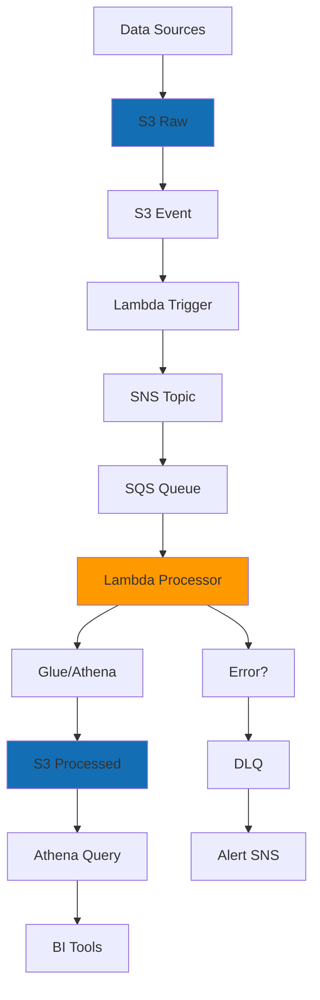

**Implementation:**

```python
# Lambda: S3 Event Handler
def s3_event_handler(event, context):
    sns = boto3.client('sns')
    
    for record in event['Records']:
        message = {
            'bucket': record['s3']['bucket']['name'],
            'key': record['s3']['object']['key'],
            'size': record['s3']['object']['size'],
            'event_time': record['eventTime']
        }
        
        sns.publish(
            TopicArn=os.environ['SNS_TOPIC_ARN'],
            Message=json.dumps(message)
        )

# Lambda: Data Processor
def data_processor(event, context):
    s3 = boto3.client('s3')
    
    for record in event['Records']:
        message = json.loads(record['body'])
        bucket = message['bucket']
        key = message['key']
        
        try:
            # Download and process
            obj = s3.get_object(Bucket=bucket, Key=key)
            data = obj['Body'].read()
            
            # Process data
            processed = transform_data(data)
            
            # Upload processed data
            output_key = key.replace('raw/', 'processed/')
            s3.put_object(
                Bucket=bucket,
                Key=output_key,
                Body=processed
            )
            
        except Exception as e:
            # Message goes to DLQ after max receives
            raise e
```

### 10.2 VPC Endpoints for Private Access

**VPC Endpoint Architecture:**

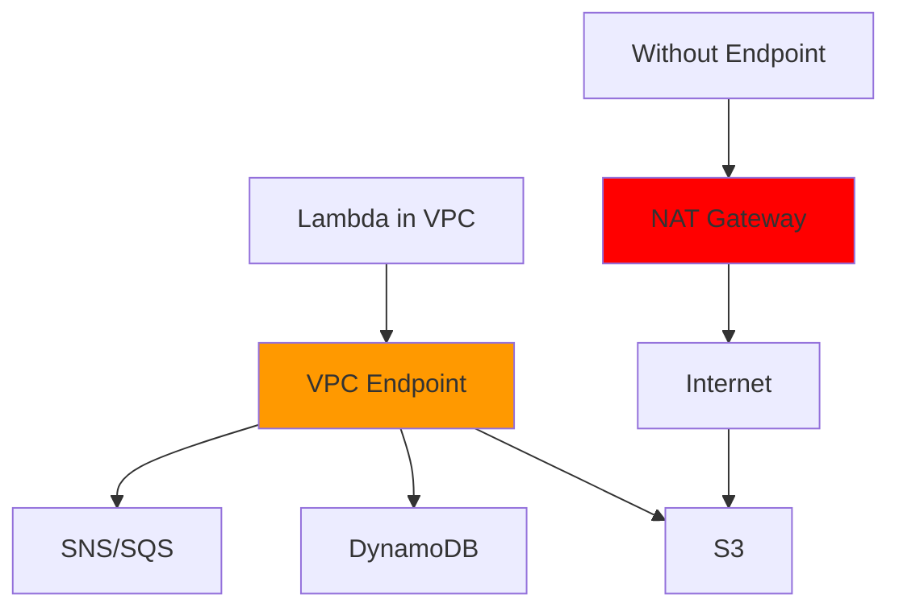

**Benefits:**

* **No NAT Gateway costs** - Direct AWS service access
* **Better performance** - Lower latency
* **Enhanced security** - Traffic stays in AWS network

**Creating VPC Endpoint:**

```bash
aws ec2 create-vpc-endpoint \
  --vpc-id vpc-xxxxx \
  --service-name com.amazonaws.us-east-1.s3 \
  --route-table-ids rtb-xxxxx
```

---

## 11. Monitoring and Observability

### 11.1 CloudWatch

**Key Metrics:**

* **Lambda**: Invocations, Duration, Errors, Throttles
* **SQS**: ApproximateNumberOfMessages, NumberOfMessagesSent
* **S3**: BucketSizeBytes, NumberOfObjects
* **Athena**: DataScannedInBytes, EngineExecutionTime

**CloudWatch Alarms:**

```python
import boto3

cloudwatch = boto3.client('cloudwatch')

cloudwatch.put_metric_alarm(
    AlarmName='lambda-error-rate',
    ComparisonOperator='GreaterThanThreshold',
    EvaluationPeriods=1,
    MetricName='Errors',
    Namespace='AWS/Lambda',
    Period=300,
    Statistic='Sum',
    Threshold=5.0,
    AlarmActions=['arn:aws:sns:us-east-1:ACCOUNT:alerts'],
    Dimensions=[
        {'Name': 'FunctionName', 'Value': 'data-processor'}
    ]
)
```

### 11.2 Logging Best Practices

**Structured Logging:**

```python
import json
import logging

logger = logging.getLogger()
logger.setLevel(logging.INFO)

def lambda_handler(event, context):
    logger.info(json.dumps({
        'event': 'processing_started',
        'request_id': context.request_id,
        'function_name': context.function_name
    }))
    
    try:
        # Process
        result = process_data()
        
        logger.info(json.dumps({
            'event': 'processing_complete',
            'status': 'success'
        }))
        
        return result
    except Exception as e:
        logger.error(json.dumps({
            'event': 'processing_failed',
            'error': str(e),
            'error_type': type(e).__name__
        }))
        raise
```

---

## 12. Security Best Practices

### 12.1 IAM Roles and Policies

**Lambda Execution Role:**

```json
{
  "Version": "2012-10-17",
  "Statement": [
    {
      "Effect": "Allow",
      "Action": [
        "s3:GetObject",
        "s3:PutObject"
      ],
      "Resource": "arn:aws:s3:::data-lake-bucket/*"
    },
    {
      "Effect": "Allow",
      "Action": [
        "sqs:ReceiveMessage",
        "sqs:DeleteMessage"
      ],
      "Resource": "arn:aws:sqs:us-east-1:ACCOUNT:queue"
    },
    {
      "Effect": "Allow",
      "Action": [
        "logs:CreateLogGroup",
        "logs:CreateLogStream",
        "logs:PutLogEvents"
      ],
      "Resource": "arn:aws:logs:*:*:*"
    }
  ]
}
```

### 12.2 Encryption

**S3 Encryption:**

```python
# Server-side encryption
s3.put_object(
    Bucket='data-lake-bucket',
    Key='sensitive-data.csv',
    Body=data,
    ServerSideEncryption='AES256'  # or 'aws:kms'
)

# Client-side encryption
from cryptography.fernet import Fernet

key = Fernet.generate_key()
cipher = Fernet(key)

encrypted_data = cipher.encrypt(data)
s3.put_object(
    Bucket='data-lake-bucket',
    Key='encrypted-data.csv',
    Body=encrypted_data
)
```

---

## 13. Cost Optimization

### 13.1 Cost Optimization Strategies

**S3:**

* Use lifecycle policies
* Choose appropriate storage classes
* Enable S3 Intelligent-Tiering
* Delete old/unused data

**Lambda:**

* Right-size memory (affects CPU and cost)
* Use provisioned concurrency only when needed
* Optimize code to reduce execution time
* Use Lambda layers for shared dependencies

**Athena:**

* Partition data properly
* Use columnar formats (Parquet)
* Compress data
* Use result caching
* Limit columns in SELECT

**SQS:**

* Use long polling (reduces API calls)
* Delete messages promptly
* Use FIFO only when needed (more expensive)

---

## 14. Troubleshooting

### 14.1 Common Issues

**Lambda Timeouts:**

* Increase timeout setting
* Optimize code performance
* Check VPC configuration (cold starts)

**SQS Messages Not Processing:**

* Check visibility timeout
* Verify consumer is running
* Check DLQ for failed messages
* Review CloudWatch metrics

**Athena Slow Queries:**

* Check data format (use Parquet)
* Verify partitioning
* Review data scanned (use EXPLAIN)
* Check for small files (many small files = slow)

**VPC Connectivity:**

* Verify security group rules
* Check route tables
* Verify NAT Gateway (for internet access)
* Use VPC endpoints for AWS services

---

## 15. Next Steps

### 15.1 Learning Path

1. **Week 1-2**: AWS Fundamentals
   * Set up AWS account
   * Learn IAM basics
   * Create VPC and subnets
   * Upload data to S3

2. **Week 3-4**: Compute and Storage
   * Create Lambda functions
   * Set up S3 lifecycle policies
   * Learn S3 event notifications

3. **Week 5-6**: Data Services
   * Set up Athena
   * Create Glue catalog
   * Write SQL queries

4. **Week 7-8**: Messaging
   * Set up SQS queues
   * Configure SNS topics
   * Build event-driven pipelines

5. **Week 9-10**: Advanced Topics
   * VPC endpoints
   * Security best practices
   * Cost optimization
   * Monitoring and alerting

### 15.2 Resources

* [AWS Documentation](https://docs.aws.amazon.com/)
* [AWS Well-Architected Framework](https://aws.amazon.com/architecture/well-architected/)
* [AWS Training](https://aws.amazon.com/training/)
* [AWS re:Post](https://repost.aws/) - Community Q&A

---

## 16. References

* [AWS Lambda Documentation](https://docs.aws.amazon.com/lambda/)
* [Amazon S3 Documentation](https://docs.aws.amazon.com/s3/)
* [Amazon Athena Documentation](https://docs.aws.amazon.com/athena/)
* [Amazon SQS Documentation](https://docs.aws.amazon.com/sqs/)
* [Amazon SNS Documentation](https://docs.aws.amazon.com/sns/)
* [Amazon VPC Documentation](https://docs.aws.amazon.com/vpc/)

